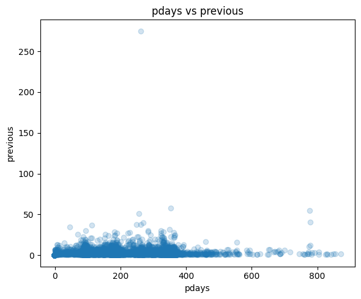
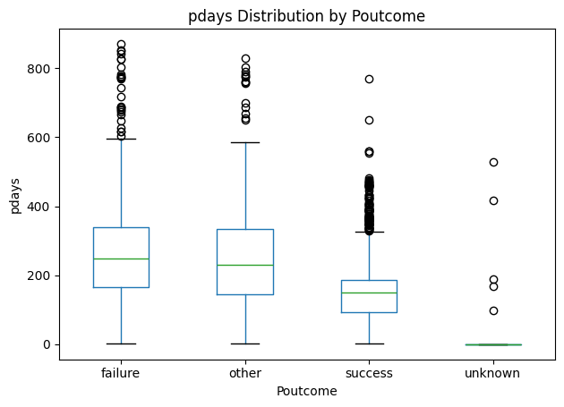
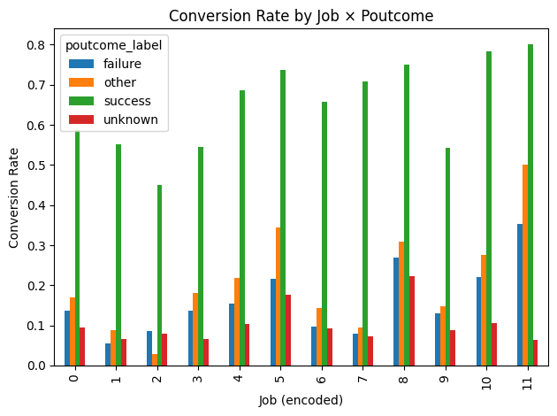
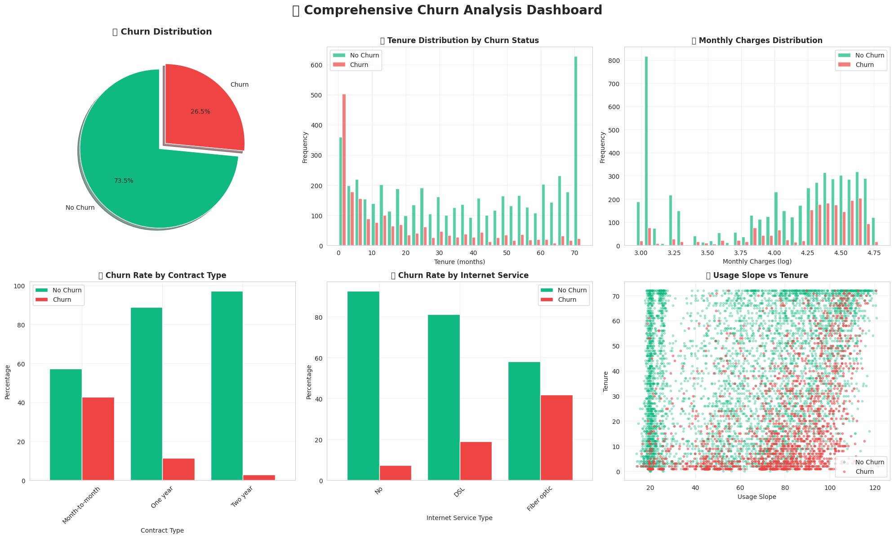

# Project ChurnBot — Interpretable Customer Decision Intelligence
> *Proving that you can have your cake (performance) and eat it too (interpretability).*

**Current Application:** Predicting term deposit subscriptions using glass-box ML

*Predict, prevent, and proactively respond to customer behavior with a research-backed AI assistant*

**Tech Stack:**
 SQLite, 
 Jupyter, 
 Python, 
 PyTorch, 
 C++, 
 TypeScript, 
 Docker, 
 React, 
 Node.js

**Author:** 👤 Phillip Harris

---
> ⚠️ **Research Status & Dataset Transition Notice**
>
> This project is under active research and architectural refinement.
> While the core glass-box cascade methodology is now established,
> the current focus has shifted from architectural prototyping to
> rigorous application and validation on real-world data.
>
> Notable updates:
> - The system previously transitioned from the synthetic Telco churn dataset
>   (used for early architectural validation) to a real-world bank marketing
>   subscription dataset to improve external validity.
> - During deeper causal and leakage auditing of the bank marketing dataset,
>   multiple structural issues were identified that materially limit its suitability
>   for realistic deployment-oriented modeling:
>     - **`duration` encodes post-outcome information and constitutes direct label leakage.**
>     - **`poutcome` contains outcome-derived information from prior campaigns and behaves as a semi-leaky proxy.**
>     - **`pdays` strongly correlates with `poutcome` and acts as a numeric surrogate for the same leakage signal.**
>     - Approximately **82% of samples collapse into a single “unknown” regime**, severely limiting meaningful
>       behavioral segmentation once leaky features are removed.
>     - Removing these features produces a large and irreversible performance drop, indicating that much of the
>       dataset’s apparent predictive power is driven by post-event artifacts rather than causal drivers.
> - As a result, the project is **actively migrating to a new real-world subscriber / churn dataset that satisfies
>   strict data integrity, leakage, and interpretability requirements.**
> - **Notably, these issues were first surfaced by the system itself via the interpretable rule lattice.**  
>   Following removal of `duration`, rule generation became dominated by `poutcome_success` rules exhibiting
>   high precision but extremely low coverage — a signature of shortcut or proxy leakage rather than meaningful
>   behavioral structure. This anomaly triggered deeper causal inspection of `poutcome` and `pdays`, leading to
>   confirmation of proxy leakage and regime collapse.
> - The **core glass-box cascade architecture remains unchanged** and will be revalidated on the new dataset.
> - Performance metrics, feature attributions, and examples in this README will be updated once the next dataset
>   passes full audit and validation.
> - Earlier experimental components (e.g., RNN-based stages) remain in the repository for historical reference
>   but are not part of the canonical pipeline.
>
> **Current research objective:**  
> Develop and validate a fully interpretable, abstention-aware glass-box cascade for
> real-world customer decision modeling using rigorously audited, leakage-free data.

📊 Leakage & Regime Collapse Diagnostics
<p align="center">    </p>

Figure — Structural leakage and regime collapse in the bank marketing dataset.
(Left) pdays is tightly coupled with previous, indicating that recency largely encodes prior contact history rather than independent behavioral signal.
(Center) The dominant poutcome=unknown regime collapses near zero pdays, while non-unknown regimes exhibit wide separation — demonstrating that pdays acts as a numeric surrogate for campaign outcome state.
(Right) Conversion rates sharply diverge only when conditioning on known poutcome, while the dominant unknown regime exhibits weak and compressed signal across job segments — confirming proxy leakage and loss of meaningful segmentation once leaky features are removed.

---
## 📖 Synopsis
Project ChurnBot is a research-driven, glass-box decision intelligence system for customer behavior prediction using fully interpretable cascade architectures. Instead of treating customer decisions as a single black-box prediction task, the system decomposes decision-making into explicit, interpretable stages that capture linear effects, interaction-driven rules, and non-linear response curves.

The cascade serves as the core reasoning engine, producing abstention-aware, fully explainable predictions. A lightweight NLP interface enables natural-language interaction with model outputs and explanations, while remaining optional to the core system.

The result is a transparent, high-performance ensemble where every decision can be traced to human-readable logic—enabling trustworthy deployment without sacrificing predictive power.


*Dataset visualization from early Telco churn experiments; current bank marketing 
dataset analysis forthcoming.*

---
## 🚨 Problem: The Interpretability–Performance Trade-off Myth

The ML industry perpetuates a harmful misconception: **“You must sacrifice accuracy for interpretability.”**  
However, this trade-off is **not inherent**.

This belief leads to:
- Black-box models deployed in high-stakes retention settings where transparency is critical
- Business teams unable to understand or trust model decisions
- Missed opportunities for actionable retention strategies
- Increased regulatory and compliance risk in customer intervention policies

**Current Industry Practice**: Deploy XGBoost or neural networks and rely on post-hoc explanation methods (e.g., SHAP, LIME) that approximate—rather than reveal—the underlying decision logic.

**Our Solution**: A fully interpretable glass-box cascade that can **compete with or outperform** traditional black-box approaches while providing complete transparency. Every prediction is grounded in explicit rules, linear coefficients, and additive shape functions, enabling **faithful, exact explanations** rather than approximations.

---
## 🎯 Architecture: 100% Glass Box Four-Stage Cascade
```
Stage 1: Logistic Regression (Linear Signals)
  ↓ Captures global linear trends via interpretable coefficients

Stage 2: Sequential GLASS-BRW  
        (Gated Logistic Abstention Structured System — Best Rules Win)
  ↓ Routing-first, depth-aware rule lattice
  ↓ Explicitly isolates high false-negative risk regions
  ↓ Pass 1 routes risky samples forward; abstains on confident non-subscriber regions
  ↓ Pass 2 predicts SUBSCRIBE only when confident; otherwise abstains

Stage 3: Explainable Boosting Machine (EBM)
  ↓ Models non-linear effects via additive, interpretable shape functions
  ↓ Resolves uncertainty in routed or abstained samples

Stage 4: Meta-EBM (Abstention-Aware Decision Arbiter)
  ↓ Evaluates and arbitrates predictions from LR, GLASS-BRW, and EBM
  ↓ Selects the most reliable interpretable decision based on confidence and agreement
  ↓ Optionally abstains when no stage is sufficiently certain
  ↓ Emits a final decision (or abstention) signal to downstream consumers (e.g., NLP interface) 
  ↓ Explicitly communicates uncertainty rather than forcing a prediction

Customer-Level Predictions with End-to-End Explainability
```

### Key Innovation: Every Stage is Interpretable

- **Logistic Regression**: Direct coefficient inspection 
- **Sequential GLASS-BRW**: Explicit IF–THEN rules with abstention and routing
- **EBM**: Additive shape functions exposing non-linear relationships in the data
- **Meta-EBM**: Interpretable weighting of stage outputs, revealing how and when each model is trusted

---

## 🧠 Core Thesis: Glass Boxes Can Outperform Black Boxes

**Research Hypothesis**: Carefully designed glass-box ensemble architectures can match or exceed black-box performance while preserving full interpretability; especially in structured decision domains such as customer retention and subscription modeling.

### Supporting Observations

- **Competitive performance** observed in prior experimental evaluations relative to black-box baselines
- **High stability** across validation splits due to deterministic routing and abstention mechanisms
- **Complete interpretability**: all predictions are decomposable into coefficients, explicit rules, and additive shape functions
- **Operational value**: transparent decision logic enables trust, auditability, and actionable intervention strategies

This work argues that the perceived **accuracy–interpretability trade-off** is an architectural choice, not a fundamental limitation in structured decision-making domains.

---

## 🗣️ User Interface: NLP-Driven Interaction

Project ChurnBot features a natural language processing interface that streamlines user interaction. Users can input queries in plain language, and ChurnBot:

1. **Collects and preprocesses** user input  
2. **Routes the request** to the relevant model(s) with full glass box transparency
3. **Interprets model predictions** and provides actionable results with explicit reasoning

This allows analysts and executives to interact with complex ML pipelines effortlessly, turning raw predictions into meaningful insights with complete explainability.

---

## 🎯 Choose Your Experience

⚡ **Terminal Version (Light)**: For business analysts and technical teams — fast, efficient insights through command-line interaction with full rule/coefficient visibility.

📈 **Dashboard Version (Heavy)**: For executives and decision-makers — rich visualizations of shape functions, rule networks, and model weights for executive-ready presentations.

Both versions maintain 100% interpretability and transparency. All computations run locally, keeping sensitive customer data on your network as opposed to a 3rd-party cloud.

---

## 🔒 Privacy & Security: Local-First Philosophy

ChurnBot runs entirely on your machine with zero cloud dependencies:

✅ No external data transfers — sensitive customer data never leaves your network  
✅ No monthly fees or API costs  
✅ Full data sovereignty — maintain compliance and avoid regulatory penalties  
✅ Immediate analysis — no network latency or downtime  
✅ Complete interpretability — every prediction fully explainable for audit trails

Compare this to black-box cloud APIs with inherent data exposure risks and unexplainable predictions.

---

### 💼 Real-World Impact

**Business ROI**:
- 📉 Reduce customer acquisition costs through precise sample targeting 
- 📈 Improve executive decision-making with actionable insights 
- 🛡️ Maintain full data sovereignty → avoid compliance penalties
- 💰 Eliminate cloud API costs and subscription fees
- 🎯 Reduce false positives leading to more focused marketing spend

**Security & Compliance ROI**:
- 🔒 Complete data privacy — no external data exposure
- 📋 Regulatory compliance through complete audit trail (every prediction can be traced)
- 🏢 Enterprise-grade security through local execution
- 📊 Explainable AI for high-stakes decisions (GDPR, fair lending compliance)

---

## 🎯 Current Research Focus

- ✅ Full glass box architecture achieved
- ✅ Rule extraction from Random Forest 
- ✅ EBM integration for non-linear patterns
- ✅ Meta-EBM for interpretable ensemble weighting
- 🔄 Cross-dataset validation (telecom, SaaS, retail)
- 🔄 Interactive visualization tools
- 🔄 Research paper preparation

---

## ⚠️ Limitations

- Dataset variability imposes generalization challenges
- Rule consolidation requires domain expertise for threshold tuning
- Glass box conversion adds one-time computational overhead
- Shape function interpretability requires statistical literacy

---

## 📚 Dataset Sources & Citations

### **1) Bank Marketing – Term Deposit Subscription (Current Benchmark)**

This project uses the **Bank Marketing** dataset for primary empirical evaluation.
The dataset is publicly available for research use via the UCI Machine Learning Repository.

**Dataset Source:**  
Moro, S., Rita, P., & Cortez, P. (2014).  
*Bank Marketing Dataset.*  
UCI Machine Learning Repository.  
DOI: https://doi.org/10.24432/C5K306

**Required Citation (Academic):**  
Moro, S., Laureano, R., & Cortez, P. (2011).  
*Using Data Mining for Bank Direct Marketing: An Application of the CRISP-DM Methodology.*  
In P. Novais et al. (Eds.), *Proceedings of the European Simulation and Modelling Conference – ESM’2011*,  
pp. 117–121, Guimarães, Portugal. EUROSIS.

Available at:  
- PDF: http://hdl.handle.net/1822/14838  
- BibTeX: http://www3.dsi.uminho.pt/pcortez/bib/2011-esm-1.txt

**Public Access:**  
- UCI Machine Learning Repository: https://archive.ics.uci.edu/ml/datasets/bank+marketing

---

### **2) IBM Telco Customer Churn Dataset (Exploratory / Feasibility)**

The IBM Telco Customer Churn dataset was used during early experimentation to validate
the feasibility of the glass-box cascade architecture. Results derived from this dataset
should be interpreted as **architectural validation**, not final performance claims.

Originally published by IBM as part of the **IBM Analytics Accelerator Catalog**.

**Original Source (IBM):**  
https://www.ibm.com/communities/analytics/watson-analytics-blog/guide-to-customer-churn-dataset/

**Public Mirrors:**  
- Kaggle: https://www.kaggle.com/datasets/blastchar/telco-customer-churn  
- OpenML: https://www.openml.org/d/42178

## 📂 Project Structure
```
prototype/
├── data/
│   ├── raw/
│   │   └── WA_Fn-UseC_-Telco-Customer-Churn.csv
│   └── test_splits/
├── churn_pipeline/   # TODO: extract churn model interface into interfaces/
│   ├── __init__.py
│   ├── data_loader.py            ✅
│   ├── preprocessor.py           ✅
│   ├── feature_engineer.py       # Optimizing
│   ├── leakage_monitor.py        ✅
│   ├── cascade_model.py          ✅
│   ├── cascade_model_cpp_wrapper.py ✅
│   └── experiment_runner.py      ✅
├── chatbot_pipeline/
│   ├── __init__.py
│   ├── user_input_handler.py          # TODO: implement input parsing and validation
│   ├── query_processor.py             # TODO: implement query formatting for each model
│   ├── churn_prediction_interface.py  # TODO: connect to Churn model pipeline interface
│   ├── security_model_interface.py    # TODO: connect to Security pipeline interface
│   ├── it_model_interface.py          # TODO: connect to IT pipeline interface
│   └── response_generator.py          # TODO: implement response formatting and templates
├── security_pipeline/
│   ├── __init__.py
│   ├── threat_data_loader.py          # TODO: implement security data loading
│   ├── threat_preprocessor.py         # TODO: implement cleaning and preprocessing
│   ├── feature_engineer.py            # TODO: implement security-specific feature extraction
│   ├── anomaly_detector.py            # TODO: implement anomaly detection model
│   ├── security_model_cpp_wrapper.py  # TODO: implement C++ security model wrapper
│   └── experiment_runner.py           # TODO: implement experimentation framework
├── it_pipeline/
│   ├── __init__.py
│   ├── it_data_loader.py              # TODO: implement IT data loading
│   ├── it_preprocessor.py             # TODO: implement IT data cleaning and preprocessing
│   ├── feature_engineer.py            # TODO: implement IT-specific feature engineering
│   ├── predictive_model.py            # TODO: implement predictive model for IT metrics/outages
│   ├── it_model_cpp_wrapper.py        # TODO: implement C++ IT model wrapper
│   └── experiment_runner.py           # TODO: implement experimentation framework
├── interfaces/
│   ├── __init__.py
│   ├── churn_model_interface.py       # TODO: place extract churn model interface here
│   ├── security_model_interface.py    # TODO: define standard methods like train(), predict(), evaluate()
│   ├── it_model_interface.py          # TODO: define standard methods like train(), predict(), evaluate()
│   └── cpp_model_interface.py         # TODO: define standard C++ model interface
├── utils/
│   ├── utils.py                       # TODO: add additional shared utility functions
│   └── cpp_utils.py                   # TODO: add C++ integration utilities
├── notebooks/
│   ├── churn_pipeline_lab.ipynb       # TODO: Clean up
│   ├── chatbot_pipeline_lab.ipynb     # TODO: set up lab for multi-model chatbot experimentation
│   ├── security_pipeline_lab.ipynb    # TODO: set up lab for security experimentation
│   ├── it_pipeline_lab.ipynb          # TODO: set up lab for IT experimentation
│   └── cpp_benchmarking_lab.ipynb     # TODO: create C++ vs Python benchmarking notebook
├── cpp_models/                        # NEW: C++ optimized models directory
│   ├── shared_cpp/                    # NEW: Common C++ optimizations
│   │   ├── include/
│   │   │   ├── optimization_utils.h    # TODO: implement branch & bound, early termination
│   │   │   ├── data_structures.h       # TODO: implement cache-friendly containers
│   │   │   ├── memory_manager.h        # TODO: implement custom allocators
│   │   │   └── common_types.h          # TODO: define common data types
│   │   └── src/
│   │       ├── optimization_utils.cpp  # TODO: implement CS theory optimizations
│   │       ├── data_structures.cpp     # TODO: implement optimized data layouts
│   │       └── memory_manager.cpp      # TODO: implement memory management
│   ├── churn_pipeline_cpp/            # NEW: Churn C++ models
│   │   ├── include/
│   │   │   ├── churn_cascade.h         ✅
│   │   │   ├── random_forest.h         # Building
│   │   │   ├── neural_network.h        # Building
│   │   │   ├── recurrent_network.h     ✅
│   │   │   └── telecom_features.h      # Building
│   │   ├── src/
│   │   │   ├── churn_cascade.cpp       # Building/Opitmizing
│   │   │   ├── random_forest.cpp       # Building/Opitmizing
│   │   │   ├── neural_network.cpp      # Building/Opitmizing
│   │   │   ├── recurrent_network.cpp   # Building/Opitmizing
│   │   │   └── telecom_features.cpp    # Building
│   │   ├── bindings/
│   │   │   ├── python_bindings.cpp     ✅
│   │   │   └── __init__.py             ✅
│   │   ├── tests/
│   │   │   ├── test_rf.cpp             # TODO: implement unit tests for RF
│   │   │   ├── test_ann.cpp            # TODO: implement unit tests for ANN
│   │   │   └── test_cascade.cpp        # TODO: implement integration tests
│   │   └── CMakeLists.txt              # TODO: set up build configuration
│   ├── security_pipeline_cpp/         # NEW: Security C++ models
│   │   ├── include/
│   │   │   ├── security_cascade.h      # TODO: implement security model interface
│   │   │   ├── anomaly_detector.h      # TODO: implement anomaly detection algorithms
│   │   │   ├── bot_detector.h          # TODO: implement bot detection models
│   │   │   └── threat_classifier.h     # TODO: implement threat classification
│   │   ├── src/
│   │   │   ├── security_cascade.cpp    # TODO: implement security pipeline orchestrator
│   │   │   ├── anomaly_detector.cpp    # TODO: implement real-time anomaly detection
│   │   │   ├── bot_detector.cpp        # TODO: implement bot detection algorithms
│   │   │   └── threat_classifier.cpp   # TODO: implement threat classification
│   │   ├── bindings/
│   │   │   ├── python_bindings.cpp     # TODO: implement pybind11 security interface
│   │   │   └── __init__.py             # TODO: set up security Python module
│   │   ├── tests/
│   │   │   ├── test_anomaly.cpp        # TODO: implement anomaly detection tests
│   │   │   └── test_bot_detection.cpp  # TODO: implement bot detection tests
│   │   └── CMakeLists.txt              # TODO: set up security build configuration
│   ├── it_pipeline_cpp/               # NEW: IT C++ models
│   │   ├── include/
│   │   │   ├── it_cascade.h            # TODO: implement IT model interface
│   │   │   ├── outage_predictor.h      # TODO: implement outage prediction
│   │   │   ├── performance_monitor.h   # TODO: implement performance monitoring
│   │   │   └── servicenow_interface.h  # TODO: implement ServiceNow integration
│   │   ├── src/
│   │   │   ├── it_cascade.cpp          # TODO: implement IT pipeline orchestrator
│   │   │   ├── outage_predictor.cpp    # TODO: implement predictive maintenance
│   │   │   ├── performance_monitor.cpp # TODO: implement system performance analysis
│   │   │   └── servicenow_interface.cpp # TODO: implement ServiceNow API integration
│   │   ├── bindings/
│   │   │   ├── python_bindings.cpp     # TODO: implement pybind11 IT interface
│   │   │   └── __init__.py             # TODO: set up IT Python module
│   │   ├── tests/
│   │   │   ├── test_outage_prediction.cpp # TODO: implement outage prediction tests
│   │   │   └── test_performance.cpp    # TODO: implement performance monitoring tests
│   │   └── CMakeLists.txt              # TODO: set up IT build configuration
│   ├── benchmarks/                    # NEW: Performance benchmarking
│   │   ├── churn_benchmark.cpp         # TODO: implement churn model benchmarking
│   │   ├── security_benchmark.cpp      # TODO: implement security model benchmarking
│   │   ├── it_benchmark.cpp            # TODO: implement IT model benchmarking
│   │   ├── memory_profiling.cpp        # TODO: implement memory usage profiling
│   │   └── compare_all_pipelines.cpp   # TODO: implement comprehensive benchmarking
│   ├── scripts/                       # NEW: Build and deployment scripts
│   │   ├── build_all.sh               # TODO: create master build script
│   │   ├── install_dependencies.sh    # TODO: create dependency installation script
│   │   ├── run_benchmarks.sh          # TODO: create benchmark execution script
│   │   └── generate_bindings.sh       # TODO: create Python binding generation script
│   └── CMakeLists.txt                 ✅
├── BasePipeline.py                    # TODO: implement base class for pipelines
└── README.md
```
