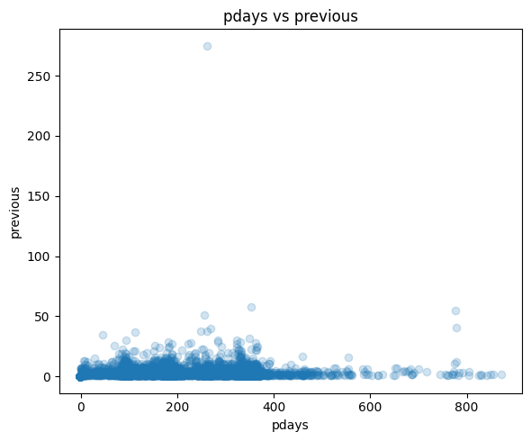
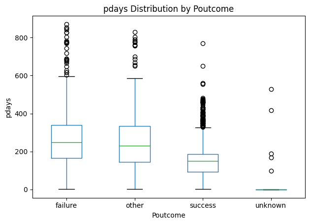
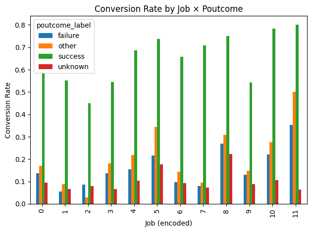

# Dataset Audit & Research Status

This document summarizes ChurnBot's transition from early Telco churn prototyping to research validation on the UCI Bank Marketing term-deposit dataset.

---

## Dataset Audit

The project moved from the synthetic IBM Telco churn dataset, used for early architectural development, to the real-world UCI Bank Marketing dataset for more demanding research validation.

Auditing identified several features that conflict with the intended **pre-contact decision task**:

- **`duration`** records call duration and is unavailable before contact occurs. It is therefore excluded as direct task leakage.

- **`poutcome`** records the outcome of a previous marketing campaign. It may be available at prediction time, but strongly conditions predictions on historical campaign success rather than the current prospect state.

- **`pdays`** records time since previous contact and is tightly coupled to prior-campaign history, acting as a strong proxy for the same regime represented by `poutcome`.

- Approximately **82% of rows fall into the `poutcome=unknown` regime**, representing prospects without usable prior-campaign history. Removing history-dependent variables therefore makes the remaining prediction problem substantially more difficult.

Removing these signals reduces predictive performance, but better aligns the experiment with the intended deployment question:

> **Should this prospect be contacted based on information available before the call?**

---

## Benchmark Comparability

Results from this project are not directly comparable to many published Bank Marketing benchmarks.

The current protocol deliberately excludes `duration`, `poutcome`, and `pdays` and evaluates a more restrictive pre-contact feature set. Many benchmark configurations answer a different prediction question and may retain some or all of these variables.

The resulting performance difference therefore reflects a different information and deployment contract rather than a like-for-like model comparison.

---

## How the Issue Was Identified

Interpretability helped surface the historical dependence early in the project.

After `duration` was removed, the symbolic rule lattice became dominated by high-precision, low-coverage rules involving `poutcome_success`. This prompted a closer inspection of `poutcome`, `pdays`, and prior-contact structure.

That audit showed that much of the apparent signal was concentrated in previous-campaign state rather than broadly distributed across current customer characteristics.

The affected variables were therefore removed from the primary research protocol.

---

## Dataset Strategy

### Research validation

**UCI Bank Marketing**

Used as the primary real-world research dataset under:

- pre-contact feature constraints;
- leakage and historical-dependency auditing;
- out-of-fold feature generation and evaluation;
- abstention-aware cascade modeling;
- interpretable and black-box comparison protocols.

### Cross-dataset validation

The finalized methodology will also be evaluated on additional datasets to determine whether the observed cascade behavior generalizes beyond Bank Marketing.

This includes cleaner or synthetic datasets where data-generation assumptions and signal quality differ substantially from the bank dataset.

### Deployment demonstration

Synthetic or permissively licensed datasets, such as IBM Telco Customer Churn, may be used for demonstration and deployment-oriented examples.

The overall system is intended as a **methodological framework** that can be adapted to proprietary churn, subscription, or binary decision-modeling problems.

---

## Current Research Objective

Develop and validate an abstention-aware, interpretable cascade architecture for customer decision modeling under realistic feature, leakage, and deployment constraints.

The Bank Marketing dataset serves as a stress test for the methodology rather than as the final deployment domain.

---

## Temporal Generalization

The dataset also contains five macroeconomic indicators reported at monthly granularity. Rows from the same period therefore share identical macro conditions.

These variables are legitimate inputs, but they can partially identify the economic period in which a contact occurred. Under a random train/test split, related periods may appear on both sides of the split.

The primary experiment retains the shared random split for controlled GLASS vs black-box comparison. A later robustness experiment will evaluate temporal generalization by training on earlier periods and testing on later periods.

Planned robustness checks include:

- random-split vs temporal-split performance;
- calibration under temporal shift;
- macro/regime feature stability;
- routing, abstention, and coverage stability across time.

---

## Leakage & Regime Diagnostics

  
  
  

**Figure — Prior-campaign structure in the Bank Marketing dataset**

**Left:** `pdays` and `previous` jointly reflect prior-contact history, showing that recency is not independent of earlier campaign activity.

**Center:** `pdays` differs strongly across `poutcome` regimes. The dominant `unknown` group is concentrated near zero while known prior outcomes occupy substantially different ranges.

**Right:** Conversion rates vary sharply when conditioned on known `poutcome` values across job groups, illustrating how strongly previous-campaign state can influence the prediction problem.

Together, these diagnostics motivated excluding `poutcome` and `pdays` from the primary pre-contact research protocol.